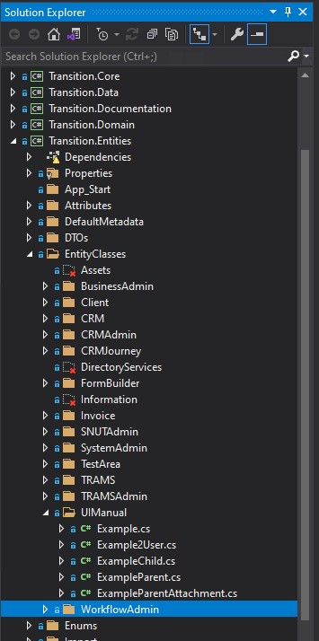
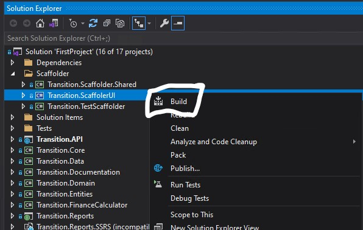
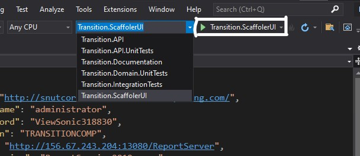
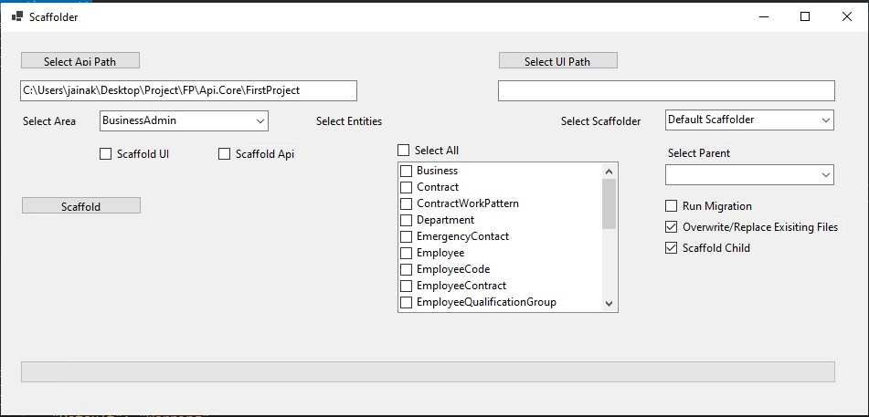
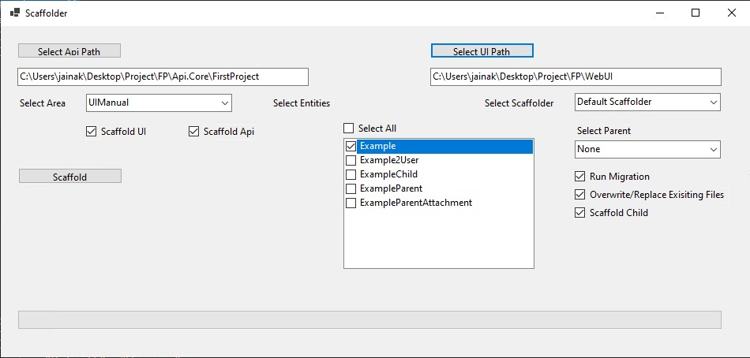

# Scaffolding First Project

## Step 1 Creating Entity Class File
---


1. Open API.Core Project using [visual Studio](https://visualstudio.microsoft.com/downloads/ 'Visual Studio').  
2. Open `Solution Explorer` and go to `transition.Entities` > `EntityClass` \


3. Create your entity class file inside Area folder. eg:- in above Image `Example.cs` is entity class file and `UIManual` is Area name.
    - Click [here](#entity-class) to learn how to create Entity class file.

4. After creating Entity class file, build `transition.ScaffolderUI`. \


5. If you want to change the Database name then open the` appsettings.Development.json` file and make changes in the ConnectionString.

## &nbsp;

## Step 2 Run The Scaffolder 
---
6. After building the project successfully, run `transition.ScaffolderUI` \


7. After succesfull run, It will show the Scaffolder UI as below.\


8. In Scaffolder UI, select WebUI project folder in the UI path.( no need to select API path as it is selected by default)
9. Now in the `Select Area` section, you should be able to see the Area name which we had created in Point 4. When we select Area name, then inside `select Entities` we should be able to see the Entity names which we had created previously. 


10. After selecting Area name and Entity, select the functionality.
    * `Scaffold UI` - Check if you want to scaffold UI.
    * `Scaffold API` - Check if you want to scaffold API.
    * `Run migration` - Check if you are scaffolding for the first time or added/removed the column from the entity class file. It will create the table or add/update columns or relations into the database.
    * `Select Parent` - If you are scaffolding child entity then you can select a parent for that entity.
    * `Scaffold Child` - If you want child entity should also get scaffolded while scaffolding some parent entity then check this.


11. After selecting functionalities, press the Scaffold button and wait until it gets completed.

12. After scaffolding gets completed, stop the `transition.scaffolderUI` and then build `transition.API`  and run it in a similar way as we had built & run `transition.ScaffolderUI`.

13. While `Transition.API` is running, open WebUI project on [visual studio code](https://code.visualstudio.com/ "visual studio code") (recommended)

14. Make sure that changes have been done after scaffolding.

15. Run the Project on the terminal using the `ng serve` command.

16. In WebUI open the `env.json` file and make sure baseURL is pointing to `https://localhost:44360/api`

17. After running API and WebUI successfully, open the browser and check the changes on `https://localhost:4200`

>## NOTE
> If you face any error during above process, Please contact to the Development team.


## &nbsp;
## &nbsp;
## &nbsp;
## Entity Class
---

To create entity class file, Open `Solution Explorer`. Then go to `transition.Entities` > `EntityClass` \


In the above screen, the folder under EntityClasses is known as Area Name.\
If you want to create a new Area, then create new folder under EntityClasses.\
Inside the Area folder, create entity class file as `EntityName.cs`.
#### &nbsp;
## Steps To write Entity Class file

```c#
namespace Transition.Entities
{
    using System;
    using System.Collections.Generic;
    using System.ComponentModel.DataAnnotations;
    using System.ComponentModel.DataAnnotations.Schema;
    using System.Linq;
    using Transition.Entities.Enums.Lookups;

    /// <summary>
    /// Example.
    /// </summary>
    public partial class Example : BaseEntity
    {
        [Required]
        [UIHint(nameof(UIHint.LongString))]
        public string TestString { get; set; }
    }
}
```
The above code is the basic structure of the entity class file, which has string Property with UIhint as LongString.

As per our requirement, we could add property fields which we have to use.

Type for Property fields will be differentiated with the help of UIHint, eg:


| Property Field Type| | Corresponding UI Hint |
| ---- | ----| ----|
| Text Input | |  ShortString |
| Text Area Box | | LongString |
| number Input | | Int |
| Date Input | | DateTime / Date |
| toggle check box | | CheckToggle |
| DropDown | | Dropdown |

Above are the few examples of Property names having UIHint.

We have more UIHints which you could see in `UIHint.cs` file, located at 
> `transition.Entities` > `Enums` > `Lookups` > `UIHint.cs`

If you want to make property field as Required, then only write ` [Required]` above the UIHint as shown in code otherwise no need to write ` [Required]`.

>## NOTE
> We have `Example.cs` class file where we have use example of all controls we have.
> You could find `Example.cs` at
>
>   `transition.Entities` > `EntityClasses` > `UIManual` > `Example.cs` 

#### &nbsp;
## Step To Create Lookup file

If you wanted to add Lookup, then you have to create a Lookup File at 

 > `transition.Entities` > `Enums` > `Lookups` 

 Create a new file under Lookups eg-  `TestLookup.cs`

 `TestLookup.cs`
 ```C#
//-----------------------------------------------------------------------
// <copyright file="CompanyStatus.cs" company="Transition Computing">
// Copyright (c) Transition Computing. All rights reserved.
// </copyright>
//-----------------------------------------------------------------------
namespace Transition.Entities.Enums.Lookups
{
    [ItemsCanBeAddedOrRemoved]
    public enum TestLookup
    {
        Test0 = 0,
        Test1 = 1,
        Test2 = 2,
        Test3 = 3,
    }
}
 ```

Above is the example of how to write a Lookup File.
